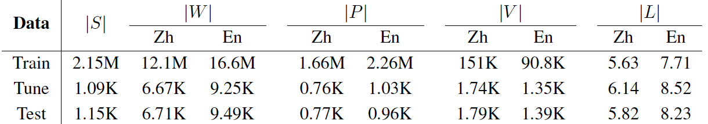

# TVsub: DCU-Tencent Chinese-English Dialogue Corpus

The corpus is designed to be dialogue domain and parallel data with larger-context information for research purpose. More than two million sentence pairs were extracted from the subtitles of television episodes. 

Within the corpus, sentences are generally short and the Chinese side contains many examples of dropped pronouns (DPs). Therefore, the corpus was initially designed for [pro-drop language](https://en.wikipedia.org/wiki/Pro-drop_language) translation task, and the related paper (Translating Pro-Drop Languages with Reconstruction Models) was accepted by [AAAI 2018](https://aaai.org/Conferences/AAAI-18/) conference. 

Actually, the corpus can be also used for various translation tasks such as larger-context MT ([Exploiting Cross-Sentence Context for Neural Machine Translation](https://arxiv.org/pdf/1704.04347.pdf); [Learning to Remember Translation History with a Continuous Cache](http://www.zptu.net)). 

**We will upload the data once our AAAI 2018 paper is published!**

## Novelty

The differences to other existing bilignaul subtitle corpora are as follows:

* We only extract subtitles of television episodes instead of movie ones. The vocabulary in movies is more sparsity than that in TV series. To aviod the long-tail problems, we use TV series data for MT tasks.

* We pre-processed the extracted data using a number of [in-house scripts](http://computing.dcu.ie/~lwang/publication/LREC2016_camera_ready.pdf) including sentence boundary detection and bilingual sentence alignment etc. Thus, we obtained a more cleaner, better-aligned, high-quality corpus.

* We keep the larger-context information instead of disordering sentences. Thus, you can mine useful discourse information from the previous or following sentences for MT.

* We randomly select two complete television episodes as the tuning set, and another two episodes as the test set. We manually create multiple references for them.

* In order to re-implement our AAAI-18 paper (Translating Pro-Drop Languages with Reconstruction Models), we also released the +DP corpus, in which the Chinese sentences are automatically labelled with DPs using alignment information.

## Getting Started

Plsease clone the repo, because we may update new version of data in the future.

```
git clone https://github.com/longyuewangdcu/tvsub.git
```

The folder stucture is as follows:

```
++ tvsub (root)
++++ data (orignal corpus)
++++++++ train
++++++++ dev
++++++++ test
++++ data+dp (+DP corpus)
++++++++ train
++++++++ dev
++++++++ test
```

## Data Details

The following table lists the statistics of the corpus. 



## Authors

* [**Longyue Wang**](http://computing.dcu.ie/~lwang/) - *crawling and pre-processing data*
* [**Zhaopeng Tu**](http://www.zptu.net) - *dev and test sets*

## Publications

if you use the data, please cite the following paper:

Longyue Wang, Zhaopeng Tu, Shuming Shi, Tong Zhang, Yvette Graham, Qun Liu. (2018). "Translating Pro-Drop Languages with Reconstruction Models", Proceedings of the 32nd AAAI Conference on Artificial Intelligence (AAAI 2018).

```
@inproceedings{wang2018aaai,
  title={Translating Pro-Drop Languages with Reconstruction Models},
  author={Wang, Longyue and Tu, Zhaopeng and Shi, Shuming and Zhang, Tong and Graham, Yvette and Liu, Qun},
  year={2018},
  publisher = {{AAAI} Press},
  booktitle={Proceedings of the Thirty-Second {AAAI} Conference on Artificial Intelligence},
  address={New Orleans, Louisiana, USA},
  pages={1--9}
}
```

The data were crawled from the subtitle websites: http://assrt.net and http://www.zimuzu.tv. If you use the TVsub corpus, please add these links (http://www.zimuzu.tv and http://assrt.net) to your website and publications!

## License

**This data is only used for research purpose**. 

Plsease read the [License Agreement](https://creativecommons.org/licenses/by-nc-nd/4.0/) before you use the data.

## Acknowledgments

The released data is part of contribution of our AAAI-18 paper. 

The ADAPT Centre for Digital Content Technology is funded under the SFI Research Centres Programme (Grant 13/RC/2106) and is co-funded under the European Regional Development Fund. Work was done when Longyue Wang was interning at Tencent AI Lab.